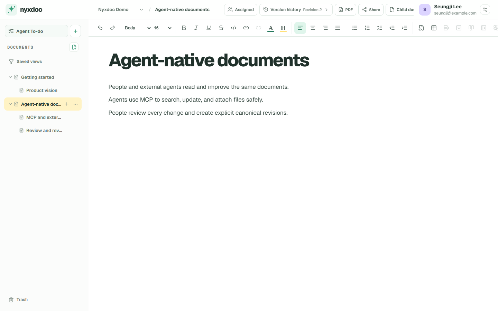

# Nyxdoc

**エージェント時代のための新しい文書システム**

[English](README.md) · [한국어](README.ko.md)

Nyxdocは、人とユーザー自身の外部エージェントが同じ文書を読み書きし、1つの変更履歴
をもとに作業を続ける文書システムです。

Codex、Claude Code、OpenClawなど、普段使っているエージェントとそのまま対話します。
エージェントはMCP/APIでNyxdocへ接続します。Nyxdoc自体が文書と人の間に別の
チャットボットを置くことはありません。

## Nyxdocの画面

以下はデザインモックではなく、新しいUbuntu環境へ実際にインストールした画面です。



人は外部エージェントへ文書作業と完了条件を登録し、同じワークスペースで返された
結果を確認できます。


## なぜNyxdocなのか

従来の文書ツールは、人がすべての変更を直接入力する前提で作られてきました。
Nyxdocは次の考えから始まります。

- 日常的な文書の読み書きの多くをエージェントが担当する
- 人は方向を示し、確認し、必要なときに直接編集する
- 人とエージェントの変更を次の作業者が理解できるようにする
- 文書には視覚的なエディターだけでなく、安定したAPI、ID、権限、リビジョンモデルが必要

Gitリポジトリはソースコードに優れています。Nyxdocは一般的な文書のために、集中
できるエディター、文書ツリー、共有下書き、明示的なリビジョン、エージェントIDと
権限、文書作業向けのプロトコルを提供します。

## 主な機能

- 見出し、リスト、表、コードブロック、内部/外部リンク、クリップボード画像、
  ショートカットを備えたNotionに馴染みのあるエディターとYjs共有下書き
- 保存ボタン、`Ctrl/⌘+S`、エージェントcommitでのみ確定する正本リビジョン
- 文書をフォルダーとして扱うツリー、幅調整ナビゲーション、保存ビュー、
  backlink、PDF、Markdown/Nyxdocバンドル出力
- 複数ワークスペースで再利用できるグローバルなエージェントIDと接続キー
- 任意で作成する組織、owner/admin/memberロール、一度限りの招待、フラットなチーム、
  人・チームへの明示的なワークスペースアクセス、組織所有エージェントと承認済みBYOA
- ワークスペース別RBAC、文書ツリー範囲、キー権限上限、有効期限、IP/CIDR制限、
  監査記録、人による承認境界
- Agent To-do：人が文書作業を登録し、担当の外部エージェントが取得、進捗報告、
  結果リビジョン提出、人の確認までを続ける流れ
- 機能検出、構造化検索、batch read、安全なpatch、冪等性、diff、復元、
  presence、変更フィード、文書へbase64を残さない短期・一度限りの画像バイナリ
  アップロードを提供するStreamable HTTP MCPとバージョンREST API
- 文書、ワークスペース、エージェントIDの30日間ゴミ箱と検証済みバックアップ後の削除
- 英語、韓国語、日本語のUIとアカウント別言語設定
- テレメトリーなし

## Docker Composeで始める

サポート対象のセルフホスティング経路はLinux、Docker Engine、Docker Compose v2です。
ライフサイクルスクリプトはBash/Linux用です。macOSとWindows Docker Desktopは
ローカル開発には使えますが、インストール・更新・アンインストール・バックアップ
復旧・本番運用のサポート対象ではありません。これらのコマンドはLinuxホストまたは
VMで実行してください。ローカル開発にはNode.js 24を使用します。

前提条件と5分間の導入経路は[オープンソース新規ユーザーガイド](docs/open-source-readiness.md)
を参照してください。

ローカルで試す場合は、1行でcloneとインストールを実行します。

```bash
git clone https://github.com/getnyxdoc/nyxdoc.git && cd nyxdoc && ./scripts/install.sh
```

インストーラーは`.env.production`を作成し、異なる2つの秘密値を画面へ表示せずに
生成し、このcheckoutのバージョンに対応するバージョン付きリリースイメージを取得して
全サービスを起動し、health checkを待ちます。このcheckoutからビルドする場合は
`./scripts/install.sh --build`を使います。

[http://localhost:3191](http://localhost:3191)を開きます。最初のアカウントがサイト
所有者になります。SMTPや独自メールドメインは不要です。最初の所有者作成後は、
既定で招待されたユーザーのみ登録できます。

更新、停止、試用環境の削除は次の明示的なコマンドで行います。

```bash
./scripts/update.sh
./scripts/uninstall.sh
./scripts/uninstall.sh --purge --confirm-purge=nyxdoc
```

`0.25.17`から`0.25.18`へ一度だけ更新する場合は、Nyxdoc checkoutで代わりに次の
コマンドを実行します。

```bash
curl -fsSL https://raw.githubusercontent.com/getnyxdoc/nyxdoc/v0.25.18/scripts/update-bootstrap.sh | bash
```

このbridgeは公開共同編集境界を先に閉じ、受理済みの編集をすべて保存してから、旧版の
updaterにバックアップを作成させます。`0.25.18`以降は通常どおり
`./scripts/update.sh`を使用します。

`update.sh`にはクリーンなGit checkoutが必要で、実行中の環境を変更する前に検証済み
バックアップを作成します。同じ更新が失敗した場合のみ、保存済みかつ再検証された
バックアップreceiptから再開できます。通常のアンインストールは文書、メディア、
バックアップ、設定、ソースを保持します。purgeはDockerデータvolumeとローカルで
ビルドしたイメージを削除しますが、外部バックアップ、設定、ソースは保持します。
HTTPS、バックアップ、更新、削除、復旧は
[DEPLOYMENT.md](DEPLOYMENT.md)を参照してください。

## ローカル開発

```bash
npm ci
cp .env.example .env.local
npm run dev
```

アプリは`http://localhost:3100`、共同編集サーバーは`127.0.0.1:3101`で起動します。

```bash
npm run typecheck
npm run lint
npm test
npm run test:editor-e2e
npm run build
```

## 外部エージェントを接続する

ログイン後、**設定 → ワークスペース → エージェント権限 → 最初のエージェントを接続**を
開きます。エージェントID、アクセスプロファイル、文書範囲、接続キーを選択します。
新しいキーの原文は一度だけ表示され、UIがMCP URL・Streamable HTTP・Bearer認証・確認手順を
含む非公開の引き継ぎ文を生成します。

接続直後に`get_capabilities`、続けて`list_agent_workspaces`を呼び出してください。5分間の
導入経路、Codex設定、OAuth、画像アップロード、Agent To-doの境界は
[docs/open-source-readiness.md](docs/open-source-readiness.md)と
[docs/agent-contract.md](docs/agent-contract.md)を参照してください。

## プロジェクトの状態

`0.25.18`は実際の文書で利用している初期0.xリリースです。データ移行は検証済み
バックアップの複製で事前にリハーサルするforward-only方式ですが、1.0まではAPIや
UIの詳細が変更される可能性があります。

個人利用が引き続き既定で、組織は任意の所有・管理境界です。組織メンバーシップだけでは
文書へアクセスできず、各ワークスペースで人またはチームへ明示的に権限を付与します。

## ドキュメント

- [製品ビジョン](docs/vision.md)
- [アーキテクチャ](docs/architecture.md)
- [ワークスペースモデル](docs/workspace-model.md)
- [組織とチームのモデル](docs/organization-model.md)
- [文書モデル](docs/document-model.md)
- [エージェントプロトコル](docs/agent-contract.md)
- [Agent To-do](docs/document-tasks.md)
- [エディター品質基準](docs/editor-quality-gate.md)
- [オープンソース新規ユーザーガイド](docs/open-source-readiness.md)
- [テストとリリース適格性](docs/testing-and-release-qualification.md)

## コミュニティとセキュリティ

IssueとPull Requestを歓迎します。[CONTRIBUTING.md](CONTRIBUTING.md)と
[CODE_OF_CONDUCT.md](CODE_OF_CONDUCT.md)をお読みください。脆弱性は
[SECURITY.md](SECURITY.md)に記載した非公開窓口へ報告してください。

NyxdocはSLAなしのベストエフォートで保守されます。サポート要求とIssueの
分類基準は[SUPPORT.md](SUPPORT.md)を参照してください。

## ライセンスとブランド

Nyxdocは[MIT License](LICENSE)で公開されるフリーかつオープンソースの
ソフトウェアで、著作権表示は© 2026 Seungji Leeです。MITの著作権表示と
許諾表示を保持する限り、誰でも個人または企業で使用、変更、再配布、再販売でき、
有料製品やホスティング／マネージドサービスとして提供することもできます。
別途の商用ライセンス、料金、ロイヤルティ、収益分配は必要ありません。

Nyxdocの名称とロゴはコードライセンスには含まれません。変更した製品には
別の名称とロゴを使用してください。「Nyxdocをベースにしている」といった
正確な説明は歓迎します。詳しくは[TRADEMARKS.md](TRADEMARKS.md)をご覧ください。

平易なライセンスガイドは[LICENSING.md](LICENSING.md)を参照してください。

## 謝辞

NyxdocはSeungji LeeがOpenAI Codexを開発協力者として活用して作成し、
GPT-5.6 Solとの作業も含まれています。Nyxdocは独立したベンダーニュートラルな
プロジェクトであり、OpenAIが後援または推奨する製品ではありません。
