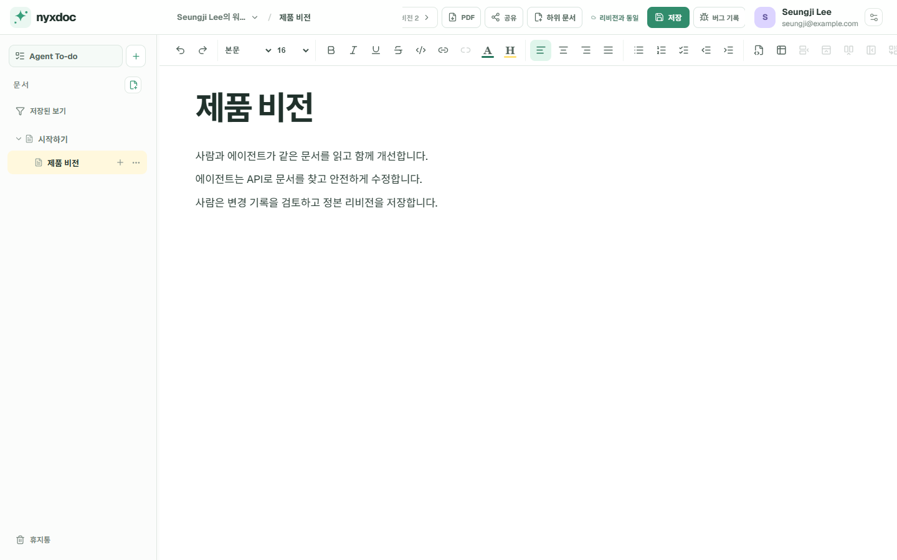

# Nyxdoc

**에이전트 시대를 위한 새로운 문서 시스템**

[English](README.md) · [日本語](README.ja.md)

Nyxdoc은 사람과 사용자의 외부 에이전트가 같은 문서를 읽고 쓰며, 하나의 변경 기록
위에서 작업을 이어가는 문서 시스템입니다.

Codex, Claude Code, OpenClaw 등 평소 사용하는 에이전트와 계속 대화하면 됩니다.
에이전트는 MCP/API로 Nyxdoc에 연결합니다. Nyxdoc 자체가 문서와 사람 사이에 별도의
챗봇을 두지는 않습니다.

## Nyxdoc 화면

아래 화면은 디자인 목업이 아니라 새 Ubuntu 환경에 직접 설치해 만든 실제 화면입니다.



사람은 외부 에이전트가 이어서 수행할 문서 작업과 완료 조건을 남기고, 같은
워크스페이스에서 결과를 확인할 수 있습니다.


## 왜 Nyxdoc인가

기존 문서 도구는 사람이 모든 변경을 직접 입력한다는 전제에서 만들어졌습니다.
Nyxdoc은 다음 기대에서 출발합니다.

- 반복적인 문서 읽기와 쓰기의 많은 부분을 에이전트가 수행합니다.
- 사람은 방향을 제시하고, 검토하며, 필요할 때 직접 편집합니다.
- 사람과 에이전트의 모든 변경은 다음 작업자가 이해할 수 있어야 합니다.
- 문서에는 시각적 편집기뿐 아니라 안정적인 API, 신원, 권한, 리비전 모델이 필요합니다.

Git 저장소는 소스 코드에 탁월합니다. Nyxdoc은 일반 문서에 집중할 수 있는 편집기,
문서 트리, 공유 초안, 명시적 리비전, 에이전트 신원과 권한, 문서 작업용 프로토콜을
제공합니다.

## 주요 기능

- 제목·목록·표·코드 블록·내부/외부 링크·클립보드 이미지 업로드·단축키를 갖춘
  Notion에 익숙한 편집기와 Yjs 공유 초안
- 저장 버튼, `Ctrl/⌘+S`, 에이전트 commit으로만 확정되는 정본 리비전
- 문서가 폴더가 되는 트리, 너비 조절 탐색, 저장된 보기, backlink, PDF,
  Markdown 및 Nyxdoc 번들 내보내기
- 여러 워크스페이스에서 재사용하는 전역 에이전트 신원과 연결 키
- 선택적으로 만드는 조직, owner/admin/member 역할, 일회용 초대, 평면 팀, 명시적
  사람·팀 워크스페이스 접근, 조직 소유 에이전트와 승인된 개인 에이전트 BYOA
- 워크스페이스별 RBAC, 문서 트리 범위, 키 권한 상한·만료·IP/CIDR 제한,
  감사 기록과 사람 승인 경계
- Agent To-do: 사람이 문서 작업을 쌓아두면 담당 외부 에이전트가 선점하고 진행 상황,
  결과 리비전, 사람 확인까지 이어가는 흐름
- 기능 발견·구조화 검색·batch read·안전한 patch·멱등성·diff·복원·presence·
  변경 피드와 문서에 base64를 남기지 않는 단기 일회용 이미지 바이너리 업로드를 제공하는
  Streamable HTTP MCP와 버전 REST API
- 문서·워크스페이스·에이전트 신원의 30일 휴지통과 검증된 백업 후 영구 삭제
- 영어·한국어·일본어 UI와 계정별 언어 설정
- 텔레메트리 없음

## Docker Compose로 시작하기

공식 운영 경로는 Linux와 Docker Compose입니다. 로컬 개발은 Node.js 24를 사용합니다.

로컬에서 시험하려면 한 줄로 복제하고 설치합니다.

```bash
git clone https://github.com/getnyxdoc/nyxdoc.git && cd nyxdoc && ./scripts/install.sh
```

설치기는 `.env.production`을 만들고, 서로 다른 비밀값 두 개를 화면에 노출하지
않고 생성하며, 정확한 릴리스 이미지를 받은 뒤 모든 서비스를 시작하고 상태를
확인합니다. 현재 소스에서 직접 빌드하려면 `./scripts/install.sh --build`를 사용합니다.

[http://localhost:3191](http://localhost:3191)을 엽니다. 최초 계정이 사이트 소유자가
됩니다. SMTP와 개인 도메인은 없어도 됩니다. 첫 소유자가 만들어진 뒤에는 기본적으로
초대받은 사용자만 가입할 수 있습니다.

업데이트, 중지 또는 시험 설치 삭제는 다음 명령으로 수행합니다.

```bash
./scripts/update.sh
./scripts/uninstall.sh
./scripts/uninstall.sh --purge --confirm-purge=nyxdoc
```

일반 삭제는 문서·미디어·백업·설정·소스를 보존합니다. 영구 삭제는 Docker 데이터
볼륨까지 제거하지만 외부 백업 디렉터리·설정·소스는 보존합니다. HTTPS, 백업,
업데이트, 삭제와 복구는 [DEPLOYMENT.md](DEPLOYMENT.md)를 참고하세요.

## 로컬 개발

```bash
npm ci
cp .env.example .env.local
npm run dev
```

앱은 `http://localhost:3100`, 협업 서버는 `127.0.0.1:3101`에서 실행됩니다.

```bash
npm run typecheck
npm run lint
npm test
npm run test:editor-e2e
npm run build
```

## 외부 에이전트 연결

Nyxdoc에서 에이전트 신원과 연결 키를 만듭니다. UI는 MCP 주소, 전송 방식, Bearer 키,
워크스페이스 역할과 확인 절차를 한 번에 복사할 수 있는 안내문을 제공합니다.

```text
전송 방식: Streamable HTTP
주소: https://your-nyxdoc.example/mcp
인증: Bearer <NYXDOC_TOKEN>
```

연결 직후 `get_capabilities`를 먼저 호출합니다. 현재 스키마, 권한, 워크스페이스 범위와
지원 도구가 반환됩니다. Agent To-do는 담당 에이전트 기준으로 조회하며 워크스페이스는
추가 맥락으로 제공합니다. 사람에게 Nyxdoc To-do를 진행하라는 명시적 요청을 받지 않은
에이전트는 대기 중인 작업을 임의로 시작하면 안 됩니다.

에이전트가 이미지를 넣을 때는 `create_image_upload`가 반환한 5분 일회용 URL에 원본
바이트를 `PUT`하고, 성공 응답의 `imageBlock`을 문서에 삽입합니다. 이미지나 base64를
MCP JSON에 싣지 않습니다.

자세한 계약은 [docs/agent-contract.md](docs/agent-contract.md)에 있습니다.

## 프로젝트 상태

`0.24.1`은 실제 문서에 사용 중인 초기 0.x 버전입니다. 데이터 마이그레이션은 검증된
백업 복제본에서 먼저 연습하는 forward-only 방식이지만, 1.0 전까지 API와 UI의 세부
사항은 변경될 수 있습니다.

개인 사용이 여전히 기본이며 조직은 선택적인 소유권·관리 경계입니다. 조직 멤버십만으로는
문서가 보이지 않고, 각 워크스페이스에서 사람 또는 팀에 명시적으로 권한을 부여합니다.

## 문서

- [제품 철학](docs/vision.md)
- [아키텍처](docs/architecture.md)
- [워크스페이스 모델](docs/workspace-model.md)
- [조직과 팀 모델](docs/organization-model.md)
- [문서 모델](docs/document-model.md)
- [에이전트 프로토콜](docs/agent-contract.md)
- [Agent To-do](docs/document-tasks.md)
- [편집기 품질 기준](docs/editor-quality-gate.md)

## 참여와 보안

이슈와 pull request를 환영합니다. [CONTRIBUTING.md](CONTRIBUTING.md)와
[CODE_OF_CONDUCT.md](CODE_OF_CONDUCT.md)를 먼저 읽어주세요. 보안 취약점은
[SECURITY.md](SECURITY.md)의 비공개 경로로 알려주세요.

Nyxdoc은 SLA 없이 최선을 다해 유지합니다. 지원 요청과 이슈 분류 경계는
[SUPPORT.md](SUPPORT.md)에 정리했습니다.

## 라이선스와 브랜드

Nyxdoc은 [MIT License](LICENSE)로 공개하는 자유·오픈소스 소프트웨어이며,
저작권자는 © 2026 Seungji Lee입니다. 누구나 MIT 저작권 및 허가 고지를
유지하는 조건으로 개인 또는 기업에서 사용·수정·재배포·재판매할 수 있고,
유료 제품이나 호스팅·관리형 서비스로 제공할 수도 있습니다. 별도의 상업용
라이선스, 이용료, 로열티 또는 수익 배분은 필요하지 않습니다.

Nyxdoc 이름과 로고는 코드 라이선스에 포함되지 않습니다. 수정한 제품은
다른 이름과 로고를 사용해야 하며 “Nyxdoc 기반”과 같은 사실 설명은 환영합니다.
[TRADEMARKS.md](TRADEMARKS.md)를 참고하세요.

쉬운 말로 정리한 라이선스 안내는 [LICENSING.md](LICENSING.md)를 참고하세요.

## 감사

Nyxdoc은 이승지 (Seungji Lee)가 OpenAI Codex를 개발 협력자로 활용해 만들었으며,
GPT-5.6 Sol과의 작업도 포함합니다. Nyxdoc은 독립적이고 특정 업체에 종속되지 않는
프로젝트이며 OpenAI가 후원하거나 보증하는 제품이 아닙니다.
