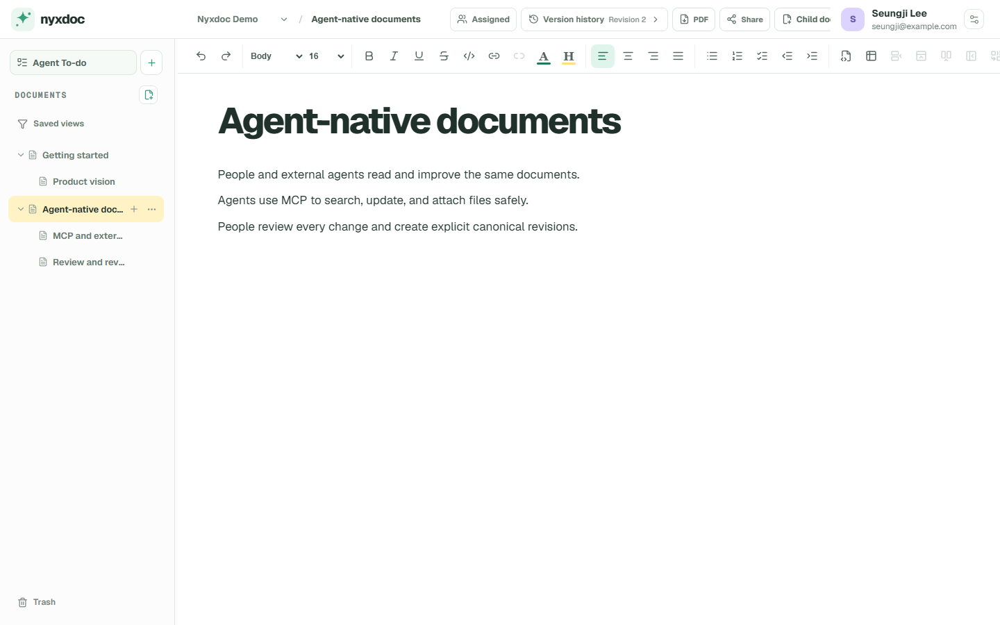
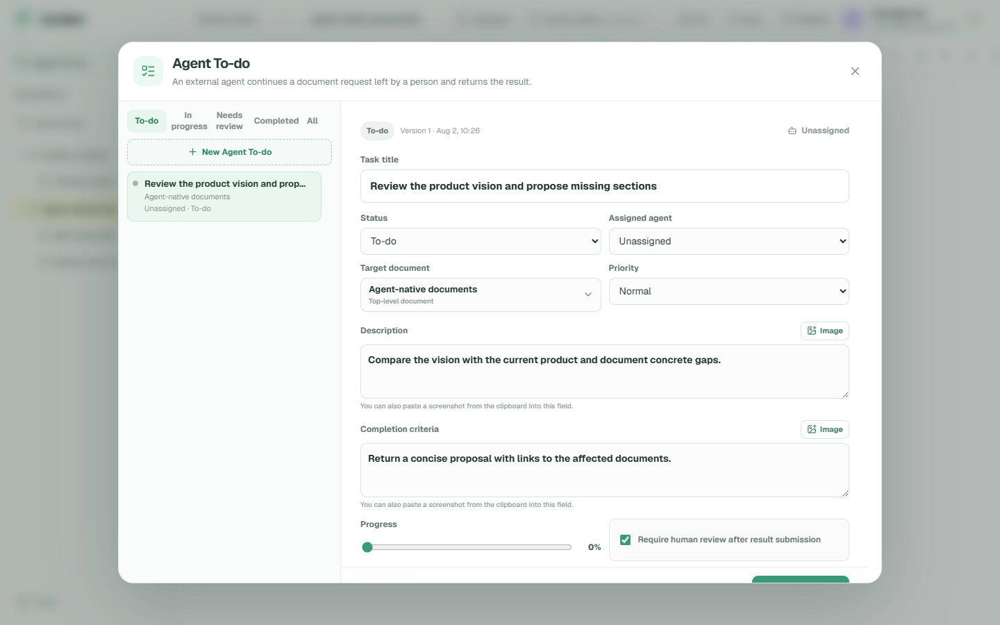

# Nyxdoc

**A new document system for the agent era.**

[한국어](README.ko.md) · [日本語](README.ja.md)

Nyxdoc is a document system where people and their external agents read and
write the same documents, then continue from one shared revision history.

You keep talking to the agent you already use—Codex, Claude Code, OpenClaw, or
another MCP client. The agent connects to Nyxdoc through MCP/API. Nyxdoc itself
does not put a chatbot between you and your documents.

## See Nyxdoc

These are real screens from a clean Ubuntu installation, not design mockups.



People can queue document work for their external agents, attach context and
completion criteria, and review the returned result in the same workspace.



## Why Nyxdoc

Most document tools were designed around people typing every change. Nyxdoc
starts from a different expectation:

- agents will do much of the routine reading and writing;
- people will guide, review, and occasionally edit directly;
- every human and agent change must remain understandable to the next actor;
  and
- documents need a stable API, identity, permission, and revision model—not
  only a visual editor.

Git repositories are excellent for source code. Nyxdoc gives ordinary
documents a focused editor, document tree, shared drafts, explicit revisions,
agent identities, scoped keys, assignments, and a protocol designed for
document work.

## Highlights

- Notion-familiar rich editor with headings, lists, tables, code blocks,
  internal/external links, clipboard image upload, shortcuts, and Yjs drafts
- explicit canonical revisions created only by Save / `Ctrl` or `⌘` + `S` /
  agent commit
- document-as-folder tree, resizable navigation, saved views, backlinks, PDF
  output, Markdown and Nyxdoc bundle export
- global agent identities and credentials reusable across workspaces
- optional organizations with owner/admin/member roles, one-time invitations,
  flat teams, explicit person/team workspace access, organization-owned agents,
  and approved personal-agent BYOA
- workspace-specific RBAC, document-tree scope, credential caps, expiry, IP/CIDR
  restrictions, audit records, and human approval boundaries
- Agent To-do: a person queues document work and an assigned external agent can
  claim, report progress, submit a result revision, and return it for review
- Streamable HTTP MCP and versioned REST APIs with capability discovery,
  structured search, batch reads, safe patching, idempotency, diffs, restore,
  presence, change feeds, and short-lived direct binary image uploads that
  never put base64 in a document
- 30-day trash and verified backup-before-purge flows for documents,
  workspaces, and agent identities
- English, Korean, and Japanese interfaces, with per-account locale
  preferences
- no telemetry

## Quick start with Docker Compose

The supported production path is Linux and Docker Compose. Node.js 24 is used
for local development.

For a local trial, clone and install in one command:

```bash
git clone https://github.com/getnyxdoc/nyxdoc.git && cd nyxdoc && ./scripts/install.sh
```

The installer creates `.env.production`, generates two different secrets
without displaying them, pulls the exact release image, starts every service,
and waits for health checks. To build this checkout instead, use
`./scripts/install.sh --build`.

Open [http://localhost:3191](http://localhost:3191). The first account becomes
the site owner. SMTP and a custom email domain are optional. Registration is
invitation-only after the first owner by default.

Update, stop, or remove the trial with explicit lifecycle commands:

```bash
./scripts/update.sh
./scripts/uninstall.sh
./scripts/uninstall.sh --purge --confirm-purge=nyxdoc
```

Normal uninstall preserves documents, media, backups, configuration, and the
source checkout. Purge removes the Docker data volume but still preserves the
external backup directory, configuration, and source. For HTTPS, backups,
updates, removal, and recovery, read
[DEPLOYMENT.md](DEPLOYMENT.md).

## Local development

```bash
npm ci
cp .env.example .env.local
npm run dev
```

The app runs at `http://localhost:3100`; the collaboration service runs at
`127.0.0.1:3101`.

Quality checks:

```bash
npm run typecheck
npm run lint
npm test
npm run test:editor-e2e
npm run build
```

## Connect an external agent

Create an agent identity and connection key in Nyxdoc. The UI provides one
copyable handoff containing the MCP URL, transport, Bearer key, workspace access profile,
and verification steps.

Generic MCP connection:

```text
Transport: Streamable HTTP
URL: https://your-nyxdoc.example/mcp
Authorization: Bearer <NYXDOC_TOKEN>
```

Nyxdoc also advertises OAuth 2.1 discovery metadata for clients that support
remote MCP authorization. OAuth uses PKCE S256 and lets the person choose the
allowed workspaces and each workspace access profile; existing Bearer connection keys
remain supported for local agents and automation.

Call the compact `get_capabilities` summary first. Fetch a full AST schema with
`get_schema` only when it is needed. It reports permissions, workspace scope,
and the recommended small-document workflow. Agent To-dos are returned by assignee,
with workspace information included as context; agents must not start queued
To-dos unless a person explicitly asks them to process Nyxdoc To-dos.

For images, an agent calls `create_image_upload`, PUTs the original bytes to
the returned five-minute single-use URL, and inserts the response's
`imageBlock`. Image bytes and base64 never travel inside the MCP JSON document.

Use `capture_handoff` when a person asks an agent to preserve a conversation as
structured project memory. It creates one document and optional ready Agent
To-dos without starting those To-dos.

See [docs/agent-contract.md](docs/agent-contract.md) for the full contract and
[docs/mcp/oauth.md](docs/mcp/oauth.md) for remote OAuth setup.

## Project status

Version `0.25.7` is an early 0.x release used with real documents. Data
migrations are forward-only and rehearsed against verified backups, but APIs
and UI details may still evolve before 1.0.

Personal use remains the default. Organizations are optional ownership and
administration boundaries; organization membership alone never grants document
access, which is assigned explicitly per person or team at each workspace.

## Documentation

- [Product vision](docs/vision.md)
- [Architecture](docs/architecture.md)
- [Workspace model](docs/workspace-model.md)
- [Organization and team model](docs/organization-model.md)
- [Document model](docs/document-model.md)
- [Agent protocol](docs/agent-contract.md)
- [MCP client compatibility](docs/mcp/compatibility.md)
- [MCP OAuth](docs/mcp/oauth.md)
- [Conversation handoff](docs/mcp/handoff.md)
- [Agent To-do](docs/document-tasks.md)
- [Editor quality gate](docs/editor-quality-gate.md)

## Community and security

Issues and pull requests are welcome. Read
[CONTRIBUTING.md](CONTRIBUTING.md) and
[CODE_OF_CONDUCT.md](CODE_OF_CONDUCT.md). Report vulnerabilities privately as
described in [SECURITY.md](SECURITY.md).

Nyxdoc is maintained on a best-effort basis without an SLA. Support requests
and issue-triage boundaries are described in [SUPPORT.md](SUPPORT.md).

## License and brand

Nyxdoc is free and open-source software under the [MIT License](LICENSE),
copyright © 2026 Seungji Lee. Anyone may use, modify, redistribute, sublicense,
or sell it, including as part of a paid product or hosted or managed service,
subject to retaining the MIT copyright and permission notice. No separate
commercial license, fee, royalty, or revenue share is required.

The Nyxdoc name and logo are not granted by the code license. Modified products
should use a distinct name and logo; factual wording such as “based on Nyxdoc”
is welcome. See [TRADEMARKS.md](TRADEMARKS.md).

See [LICENSING.md](LICENSING.md) for a plain-language licensing guide.

## Acknowledgements

Nyxdoc was created by Seungji Lee with OpenAI Codex as a development
collaborator, including work with GPT-5.6 Sol. Nyxdoc is an independent,
vendor-neutral project and is not sponsored or endorsed by OpenAI.
