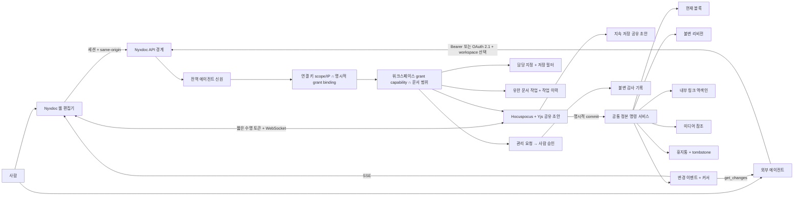

# Architecture

## 실행 환경

- Next.js 16 App Router, self-hosted Node.js
- Better Auth 이메일/비밀번호 인증과 DB 세션
- `better-sqlite3`, WAL, 명시적 즉시 트랜잭션
- 공식 Model Context Protocol TypeScript SDK
- Codex SDK 기반 선택적 참조 종단 테스트
- Nginx 또는 동등한 TLS 리버스 프록시와 Docker 게이트웨이/앱/협업 서버

## 요청 흐름

Nyxdoc은 에이전트를 서버 안에서 실행하지 않는다. Codex, OpenClaw, Claude Code 같은 외부 에이전트는 사용자의 환경에서 실행되고 `/mcp` 또는 `/api/v1`을 호출한다. Codex SDK는 이 에이전트 독립 계약을 자동 검증하는 첫 참조 클라이언트다.

## 코드 경계

- `src/lib/documents/service.ts`: 프레임워크 독립 문서 명령·조회와 트랜잭션
- `src/lib/documents/idempotency.ts`: 연결별 재시도 안전성
- `src/lib/documents/markdown.ts`: CommonMark/GFM ↔ AST v2 편의 변환
- `src/lib/documents/portability.ts`: Markdown과 lossless JSON bundle 내보내기
- `src/lib/agents/service.ts`: 전역 에이전트·키, 워크스페이스 grant와 credential binding 관리
- `src/lib/organizations/service.ts`: 조직·초대·팀·명시적 워크스페이스 grant,
  조직/개인 에이전트 소유권과 BYOA 승인, 조직 감사·수명주기 관리
- `src/lib/tokens/service.ts`: 해시 인증, 요청별 워크스페이스 바인딩, IP 제한과 연결 커서
- `src/lib/authz/*`: 사람 RBAC와 에이전트 capability 기반 인가, 워크스페이스 감사
- `src/lib/collaboration/*`: Yjs 공유 초안, 공용 draft/commit 명령, 저장 필터, 담당 지정, 만료형 presence
- `src/lib/tasks/*`: 문서 작업 상태, 선점·진행·제출 명령, 멱등성, 작업 이력과 감사 기록
- `src/lib/site-settings/*`: 최초 가입자 기반 사이트 소유자, 추가 사이트 관리자, 가입·메일·공개 주소 정책과 사이트 감사 기록
- `scripts/collaboration-server.ts`: Hocuspocus WebSocket과 인증된 내부 draft 명령 서버
- `src/lib/admin-requests/*`: capability 제한형 관리 제안, 사람 승인, stale precondition 검사
- `src/lib/mcp/server.ts`: 문서 서비스를 MCP 도구로 투영
- `src/lib/mcp/oauth.ts`: OAuth client를 전역 에이전트·워크스페이스 권한에 바인딩
- `src/app/mcp/route.ts`: Bearer 또는 OAuth 인증된 stateless Streamable HTTP 전송
- `src/app/.well-known/*`, `src/app/oauth/authorize/*`: OAuth 발견과 사람 승인
- `src/app/api/v1/*`: 외부 에이전트용 REST 표면
- `src/app/api/documents/*`, `src/app/api/tokens/*`: 검증된 웹 세션용 표면
- `src/data/workspace.ts`: 서버 렌더링용 워크스페이스 뷰 조립
- `src/components/workspace/*`: 비밀을 보관하지 않는 클라이언트 UI

워크스페이스 에이전트 grant의 선택적 루트 문서는 API 경계에서 목록·검색·변경 피드·직접 조회·쓰기 모두에
적용된다. AST 내부 문서 참조도 명령 서비스가 다시 검증하므로 클라이언트 우회가 불가능하다.

워크스페이스는 문서·사람 멤버십·에이전트 grant·필터·담당·문서 작업·휴지통·감사 로그의 테넌트
경계다. 워크스페이스는 개인 또는 조직 하나가 소유한다. 조직 멤버십만으로는 문서에 접근할
수 없고 사람 또는 평면 팀의 명시적 grant가 필요하다. 에이전트 신원도 개인 또는 조직이
소유하며, 개인 에이전트를 조직 워크스페이스에서 쓰려면 조직 관리자의 BYOA 승인이 필요하다.
에이전트 신원과 연결 키는 서로 분리된다. 키를 회전하거나 에이전트를
다른 워크스페이스에 추가 배정해도 revision의 전역 주체 ID가 유지되고, 담당 정보에는 해당
워크스페이스의 grant ID가 남는다.
사이트 전역 설정은 이 테넌트 경계 위에서 공개 URL, 가입 도메인, 이메일 인증과 SMTP의
비밀이 아닌 연결 정보를 관리한다. SMTP 비밀번호와 TLS 개인키는 DB·브라우저·감사 로그에
넣지 않고 환경 변수와 리버스 프록시에 남긴다. Agent To-do 첨부는 `media_assets`를
재사용하며 task·document·media의 워크스페이스 일치를 서비스와 DB 트리거가 함께 강제한다.
관리 요청 capability가 있는 에이전트도 고위험 작업을 직접 실행하지 않고 7일 만료 요청을 만들며, 사람 owner/admin만
승인한다. 사람과 에이전트는 같은 Yjs 문서를 문자 단위로 편집한다. 초안 업데이트는 SQLite에
계속 저장되고 브라우저에는 IndexedDB 사본이 남지만 정본 리비전은 저장 버튼·`Ctrl/⌘+S` 또는
에이전트 `commit_document`처럼 명시적인 작업에서만 생성된다. SSE는 정본 리비전 이벤트,
presence는 현재 작업 위치를 보완한다.

계정 설정은 사람 프로필·로그인을 소유하고, 에이전트 메뉴는 전역 에이전트 신원·아바타·연결
키·IP 제한을 소유한다. 워크스페이스 설정은 에이전트 grant·capability·문서 범위·감사를 소유한다.
사용자 흐름은 워크스페이스 안의 원자적 연결 마법사로 합치되 이 소유권 경계는 유지한다.
상세한 경계와 운영 이전 불변 조건은 [workspace model](workspace-model.md)에 정리한다.

초기 실험의 `conversations`, `patches`, `agent_runs` 테이블은 새 런타임 경로에서 사용하지
않는다. 공개 문서 계약은 AST v2 하나이며, 초기 테스트 문서는 `0011_canonical_ast_v2_only`
마이그레이션에서 정리한다.

## 환경

- 로컬: `./data/nyxdoc-dev.db`, `http://localhost:3100`
- 테스트: 메모리 SQLite와 로컬 `/mcp`
- 운영: Docker volume의 `/data/nyxdoc.db`, HTTP/WebSocket 게이트웨이 loopback `3191`, 협업 서버 점검용 loopback `3192`, Next 앱은 Docker 내부 전용

DB 파일, 인증 비밀, SMTP 비밀번호, API 토큰 원문은 저장소에 커밋하지 않는다. 컨테이너는 비루트 사용자로 실행하고 시작 전에 멱등 마이그레이션을 수행한다.
